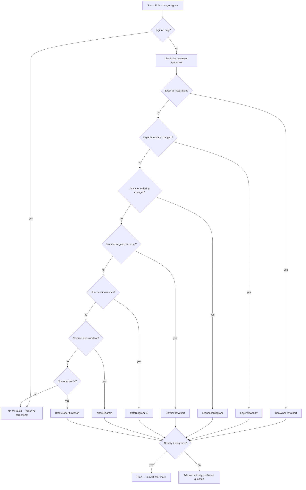
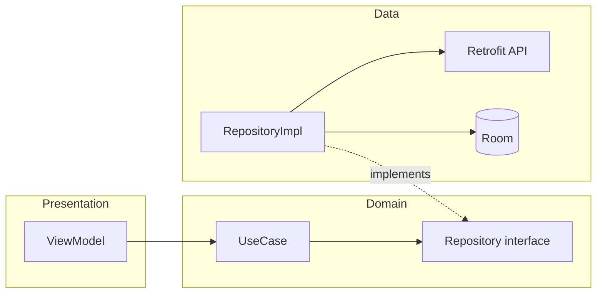
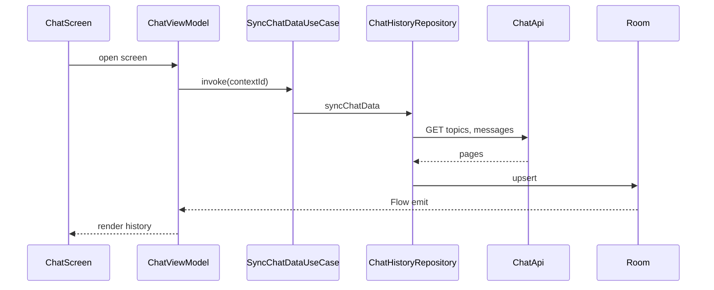
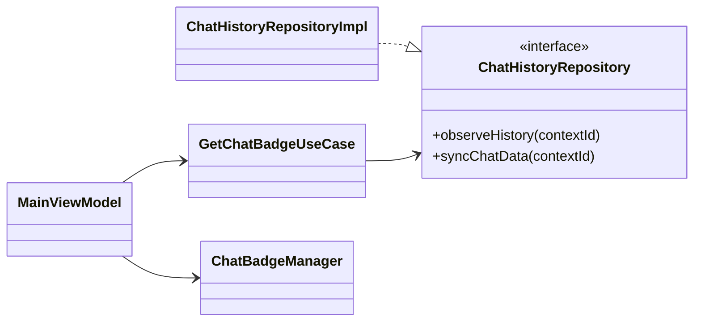
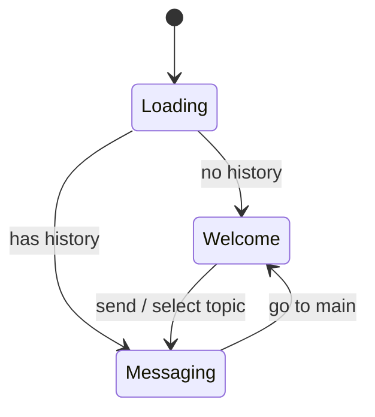

# PR diagram guide

Companion to **pull-request-drafting** `SKILL.md`. Choose diagrams from **what changed**, not how big the PR is.

## Principles

1. **Change signal → diagram type.** Classify the PR by the kinds of changes it introduces; ignore LOC and file count.
2. **One diagram = one reviewer question.** If you cannot state the question in one line, split or omit.
3. **Tables for inventory, diagrams for relationships and order.** Do not redraw the types table as a `classDiagram` with 20 nodes.
4. **Cap at two diagrams** when multiple signals apply — pick the two **distinct** questions reviewers cannot answer from prose + tables alone.
5. **GitHub must render it.** After `gh pr create` / `gh pr edit`, open the PR in the browser. Gray code block = fix fence or simplify.
6. **Plain Mermaid only** — `flowchart`, `sequenceDiagram`, `classDiagram`, `stateDiagram-v2`. For C4 *thinking*, sketch container boundaries, then output portable Mermaid.

## Change signals (primary router)

Scan the diff for **signals**. A PR may match several; each signal suggests at most **one** diagram type. Use the table below — not PR size.

| Change signal | How to recognize it in the diff | Reviewer question | Diagram type |
|---------------|----------------------------------|-------------------|--------------|
| **Hygiene only** | Strings, formatting, imports, tests mirroring prod with no new behavior | (none) | **None** |
| **Layer boundary** | New/changed repository interface, use case, or cross-module dependency (`:presentation` → `:domain` → `:data`); new DI binding across layers | Who calls whom across modules? | **Layer `flowchart`** |
| **Async / ordering** | New sync trigger, stream, pagination, `Flow` chain, context-switch refresh, multi-hop network + cache | What happens in what order? | **`sequenceDiagram`** |
| **Contract surface** | New/renamed domain ports, use cases, or key models; dependency direction non-obvious from table | What depends on what? | **`classDiagram`** (≤12 types) |
| **Branching / guards** | New error mapping, auth gate, badge rule, retry, feature flag, permission branch | Which path runs when? | **Control-flow `flowchart`** |
| **State / mode** | New screen modes, welcome vs messaging, device pairing lifecycle, wizard steps | Which states and transitions? | **`stateDiagram-v2`** |
| **External integration** | New REST path, push payload, wearable protocol, billing, third-party SDK | What leaves the app and when? | **Container `flowchart`** |
| **Persistence path** | DB schema/entity/DAO change that alters read/write path (not rename-only) | Where does data live and how does it flow? | **`sequenceDiagram`** or data-path **`flowchart`** |
| **Non-obvious fix** | Bug was wrong order, guard, or race; behavior fix without new feature | What was wrong vs what runs now? | **Before/after `flowchart`** or fix **`sequenceDiagram`** |
| **UI presentation** | Compose layout, theme, assets; no ViewModel/repository logic change | What does it look like? | **Screenshot** (not Mermaid) |

### Combining signals

| If the PR has… | Prefer… | Avoid… |
|----------------|---------|--------|
| Layer boundary **+** async/ordering | Layer `flowchart` **and** `sequenceDiagram` (structure + behavior) | Third diagram — link ADR/OpenSpec instead |
| Contract surface **+** async | Types **table** + `sequenceDiagram` | `classDiagram` that repeats the table |
| Branching **+** state/mode | Pick **one**: `stateDiagram-v2` if modes dominate; else control-flow `flowchart` | Both unless transitions and guards are equally unclear |
| External integration **+** async | Container `flowchart` + `sequenceDiagram` (happy path) | Full C4 Level-4 in the PR body |
| Hygiene **+** anything else | Ignore hygiene for diagram choice | Diagram "because the PR is large" |

**Hard rule:** No diagram whose answer is already obvious from a one-sentence behavior note or the types table.

## Decision flow (change-based)



Walk the tree in practice, but **stop at two diagrams** total.

## Diagram type reference

| Type | Mermaid keyword | Best for signals |
|------|-----------------|------------------|
| Layer / container | `flowchart TB` / `LR` | Layer boundary, external integration |
| Sequence | `sequenceDiagram` | Async/ordering, persistence path |
| Class / contract | `classDiagram` | Contract surface |
| Control flow | `flowchart` | Branching / guards |
| State | `stateDiagram-v2` | State / mode |
| Before / after | Two small `flowchart`s or subgraphs | Non-obvious fix |

## Templates (by signal)

### Layer boundary → flowchart



### Async / ordering → sequence



### Contract surface → class (≤12 types)



### State / mode → stateDiagram



## Placement in PR body

1. Motivation → scope → behavior
2. Module + types **tables**
3. **Diagrams** (0–2), each under a heading named for the **question**:
   - `### Architecture` — layer/container
   - `### Flow` — sequence or control-flow
   - `### Contracts` — class (only if not redundant)
   - `### States` — state diagram
   - `### Fix` — before/after
4. Test plan → OpenSpec / ADR (short)

## GitHub Mermaid hygiene

| Do | Avoid |
|----|--------|
| Fence: ` ```mermaid ` on its own line | Missing language tag |
| Node IDs: `camelCase`, `snake_case` | Spaces in IDs |
| `subgraph id [Label]` | `subgraph Domain` without id |
| Quote labels with `()`, `/` | Raw special chars breaking parser |
| `endNode[End]` not `end[End]` | `end` as node id |
| ≤15 nodes per diagram | Kitchen-sink graphs |

[Creating diagrams](https://docs.github.com/en/get-started/writing-on-github/working-with-advanced-formatting/creating-diagrams)

## Anti-patterns

| Anti-pattern | Why | Instead |
|--------------|-----|---------|
| Diagram because "PR is big" | Size ≠ review need | Use change signals |
| Class diagram of every new file | Duplicates Files changed | Types table + small `classDiagram` if deps unclear |
| Sequence with 20 lifelines | Unreadable | One happy path; errors in prose |
| Diagram for hygiene-only PR | Noise | None |
| Before/after on greenfield **Add** | No meaningful "before" | Target-state sequence or layer chart |
| Third diagram in PR body | PR becomes design doc | Link ADR / OpenSpec design |

## Title tag hints (secondary — not primary router)

Tags suggest **common** signals; always confirm against the diff.

| Tag | Often matches signals | Rarely needs |
|-----|----------------------|--------------|
| `[Fix]` | Non-obvious fix, branching | classDiagram |
| `[Add]` | Layer boundary, async, external | before/after |
| `[Update]` | Async/ordering if behavior order changed | full architecture |
| `[Refactor]` | Contract surface, layer boundary | sequence unless behavior changed |
